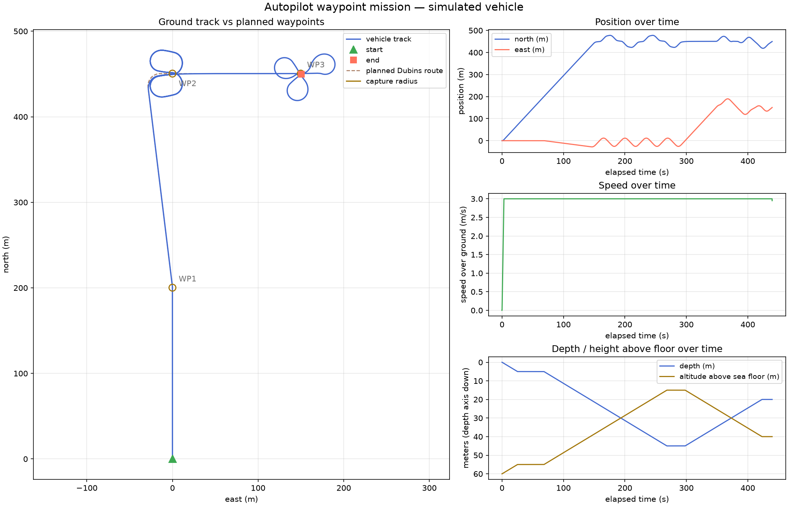
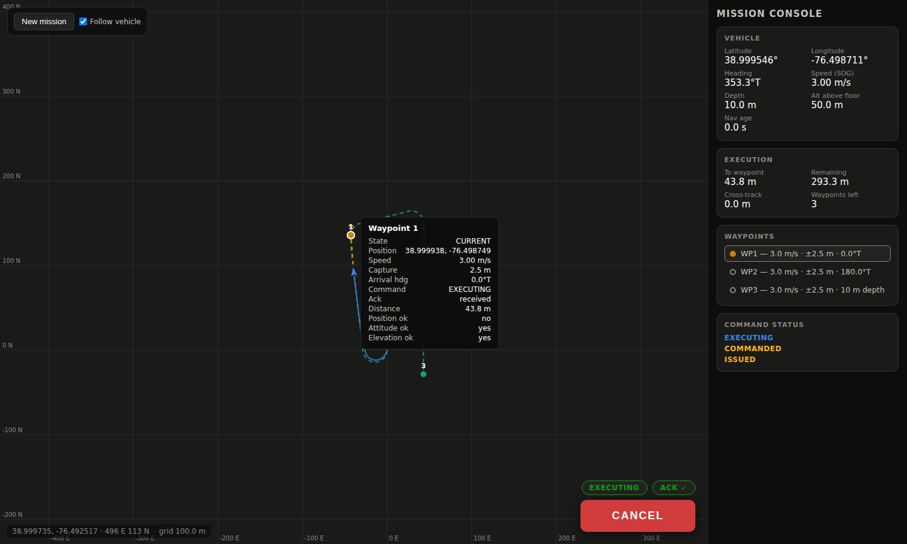

# Autopilot Application

An autopilot built on the umaa-cpp SDK. It consumes UMAA MO **Global Vector** and **Global
Waypoint** driving commands, deconflicts them over a single driving resource, and drives a
swappable vehicle-control strategy off the latest SA navigation data.

## Architecture

Three layers (namespace `arlcore::autopilot`):

1. **`AutopilotApp`** — aggregator/main class. Owns the DDS participant, the three SA nav
   consumers (Global Pose / Speed / Velocity), the two MO command providers, the autopilot
   brain, the vehicle-control strategy, and the platform report providers. Runs one control
   loop (`step()` per tick).
2. **`AutopilotBrain` (`IAutopilot`)** — the shared driving controller. Holds the active mode
   and setpoint, recomputes a `ControlVector` from the latest nav on every pose update, and
   pushes it to the vehicle. Owns the `DrivingResourceArbiter`.
3. **`IVehicleControl` strategy** — hardware abstraction (`SimVehicleControl` provided). Sends
   the control vector and serves the platform specs/capabilities. The sim strategy keeps an
   internal kinematic vehicle (limits from the platform capabilities), integrates it on its
   own thread at `vehicle_control.sim.cycle_rate_hz` acting on the latest setpoint, and
   publishes the three SA navigation reports (Global Pose / Speed / Velocity) — closing the
   control loop exactly as a real vehicle's navigation suite would. With underwater
   capabilities enabled it also simulates depth against a configurable sea floor
   (`vehicle_control.sim.floor_depth_m`), honoring both `depth` and above-sea-floor
   setpoints, and reports depth + altitudeASF in the Global Pose.

Key components:

- **`DrivingResourceArbiter`** — priority deconfliction. Vector is high priority and preempts
  an active waypoint route (-> `FAILED`/`INTERRUPTED`); a waypoint arriving while a vector
  drives is rejected (-> `FAILED`/`RESOURCE_REJECTED`). Priorities are configurable.
- **`VectorControlServiceProvider` / `WaypointControlServiceProvider`** — UMAA command
  providers (on `CommandProviderBase`). Vector is mostly pass-through with validation against
  the platform speed limit. Waypoint reads its route from the large-list element topic, plans a
  Dubins path, and reports capture progress.
- **`DubinsPathPlanner`** — a true Dubins planner and path tracker. Every leg (previous
  waypoint or the plan/replan pose, to the next waypoint) is solved as the shortest
  curvature-bounded Dubins path over all six words (LSL/RSR/LSR/RSL/RLR/LRL, closed forms in
  `DubinsPath`). The platform capabilities drive it: the planned turn radius is the kinematic
  minimum (speed / max turn rate) inflated by `turn_radius_margin` so the tracker keeps turn
  authority, and every leg ends with a straight final-approach runway through the waypoint so
  arrival happens settled on position and attitude (waypoints without an attitude requirement
  get a natural fly-through heading).

  *Tracking* is a path-frame guidance law fed by the live nav reports: commanded heading =
  planned-path tangent (sampled ~1 s ahead for actuation phase lead) + a cross-track
  correction `atan(xte / turn_radius)`. Cross-track error — and the UMAA track tolerance —
  are measured against the planned Dubins path itself, not the straight lines between
  waypoints.

  *Capture* is a **gate**, not a bubble: a segment of half-width `position_m` (or the
  waypoint's own tolerance) through the waypoint, perpendicular to the arrival heading. The
  waypoint is captured the instant the vehicle crosses the gate plane inside the half-width
  with attitude/elevation satisfied, so the vehicle always flies *through* the waypoint
  (default gate half-width: 2.5 m). Crossing outside the gate or overflying the path is a
  miss and replans the leg from the live pose, bounded by `max_misses_per_waypoint` and
  `max_replans`.

  *Depth-rate-limited legs spiral by design*: when the commanded elevation change needs more
  time than one pass of the 2D path provides (from the platform's `max_depth_change_rate`),
  the planner budgets the expected number of loop-back passes up front and elevation-only
  gate failures within that budget replan for free. Because the up-front estimate uses the
  first (usually longer) leg, the budget is recomputed from the remaining elevation error and
  the actual loop time as passes complete — but only while the elevation keeps converging at
  the platform depth rate, so a vehicle that cannot make depth still consumes the miss
  budget. Both `depth` (positive down from the surface) and `asf` (altitude above the sea
  floor, positive up) elevation frames are supported. On completion the planner commands
  zero speed.

Navigation drives the control tick: the pose observer fires inside the nav consumer's
`cycle()` and triggers the brain's recompute, so control always uses the latest fix. The
design is single-threaded (one control loop); the mutexes are defensive.

## Configuration

All parameters — including the platform specs/capabilities (which nothing else currently
publishes) — are loaded from YAML (see `config/autopilot.yaml`). On startup the platform
specs and capabilities reports are published once. Capabilities also feed the planner
(turn radius = speed / max turn rate).

## Build

The app builds as part of the SDK when `BUILD_AUTOPILOT_APP=ON` (default). It requires the
SDK's toolchain (CycloneDDS-CXX, GeographicLib, log4cxx, yaml-cpp, and the generated
`umaa-cyclone-cxx-types`), which is provided by the SDK development container.

> **Toolchain baseline**: build against CycloneDDS/CycloneDDS-CXX **master** (validated at
> `cyclonedds@8425e2e343` + `cyclonedds-cxx@53a9f114e6`, July 2026), not the 0.10.5 release.
> The 0.10.5 release needs several patches this codebase no longer carries: C++20 rejects its
> template-id destructors, `QosProviderDelegate` is declared but not implemented (the QoS XML
> profiles silently cannot load), topic names containing `::` are rejected, and — worst —
> types with `@optional` members (most UMAA reports) hit a fixed-size serialization cache, so
> a sample whose optionals are set after a smaller first write fails `dds_write` with
> `Bad Parameter`. All of these are fixed upstream on master, and the generated types build
> from the vendored IDLs with a stock `idlc -l cxx` invocation.

```bash
mkdir build && cd build
cmake .. -DCMAKE_BUILD_TYPE=Debug -DBUILD_AUTOPILOT_APP=1 -DTEST_COMMON=1
make -j"$(nproc)"
ctest --verbose            # runs autopilot_test among others
./autopilot autopilot.yaml # run the app
```

## Tests

Unit tests live under `test/` (GoogleTest), enabled with `-DTEST_COMMON=1`:

- `DubinsPathTest` — Dubins solver: word selection, degenerate cases, and randomized
  endpoint correctness (2000 configurations).
- `DubinsPathPlannerTest` — route following to completion, arrival-attitude capture,
  loop-around for waypoints behind the vehicle, miss/replan budgets, progress metrics.
- `SimVehicleControlTest` — kinematic limits (turn rate, acceleration, speed caps) and the
  three nav reports, using the SDK's `LocalReaderSender` loopback IO.
- `DrivingResourceArbiterTest` — priority/preempt/reject/release behavior.
- `YamlConfigLoaderTest` — config parsing and defaults.

The full suite (solver randomized endpoint checks, planner follow/replan/miss behavior with a
kinematic sim vehicle, `SimVehicleControl` kinematics + report publishing, arbiter, config)
runs green with `ctest`. An end-to-end waypoint mission over Cyclone DDS is exercised by
`tools/mission_runner` (see `tools/README.md`), which publishes a `GlobalWaypointCommandType`
plus its large-list route, records the vehicle track from the Global Pose reports, and exits
when the command completes.

Recorded end-to-end runs (sim vehicle at 3 m/s over Cyclone DDS on one host, every command
reaching COMPLETED) live in `docs/mission-results/`: mission/track/waypoint/planned-path
CSVs, command status logs, and rendered plots. The plots overlay the executed track on the
ideal planned Dubins route, so tracker deviation is directly visible against the plan the
UMAA track tolerance is judged on.

The baseline 4-waypoint diamond (no attitude requirements — natural fly-through headings,
2.5 m capture gates):


Survey lawnmower missions with **required arrival attitudes** (north/south lanes) at three
lane spacings — 40 m (wider than the ~28.6 m planned turning circle: simple U-turns), 20 m,
and 10 m (tighter than the planned turn radius: the Dubins solver produces bulb turns that
swing outside the lane ends and re-enter on attitude), all captured through 2.5 m gates with
zero misses. Two planner behaviors make these capture reliably: legs are planned with a
turn-radius margin over the vehicle's kinematic minimum (`planner.turn_radius_margin`) so
the controller retains authority to close tracking error mid-turn, and every leg ends with a
straight final-approach runway through the waypoint so arrival happens with position and
attitude already settled rather than on the tail of an arc.


A depth-change mission (`docs/mission-results/depth-spiral/`) exercises the spiral behavior:
waypoints command 40 m and 25 m elevation changes (one in the `depth` frame, one in `asf`)
while the platform's 0.2 m/s depth-rate limit makes each change impossible in a single pass
of the 2D path. The planner budgets the loop-back passes up front, the vehicle corkscrews on
repeated 2D replans until the elevation converges, and the passes consume no miss budget.



## Mission console

`tools/mission_console` serves a live mission-control web GUI (self-contained, no external
web dependencies): the vehicle and its trail on a pan/zoom chart, the active mission's
waypoints with per-waypoint status (completed faded, current pulsing, animated active
leg), the ideal planned Dubins route, live readouts (position, heading, speed, depth,
altitude above floor, cross-track error, distances), and a click-to-build mission editor
with per-waypoint speed / capture / arrival-heading / elevation, a Dubins route preview,
and an EXECUTE/CANCEL button wired to the full UMAA command lifecycle (ack + status
surfaced in the GUI). See `tools/README.md`.


