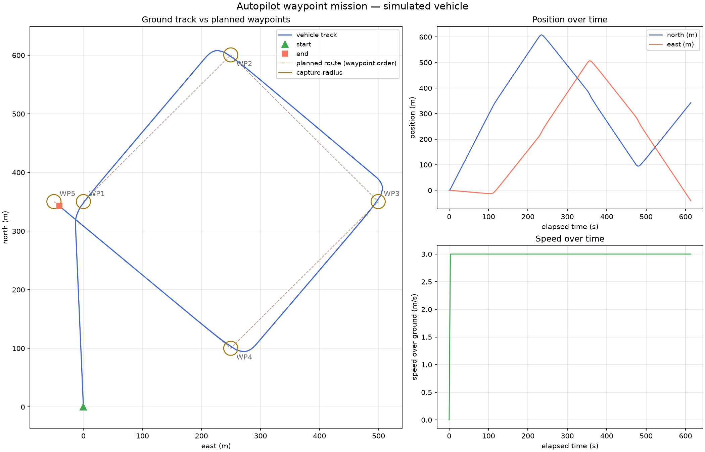
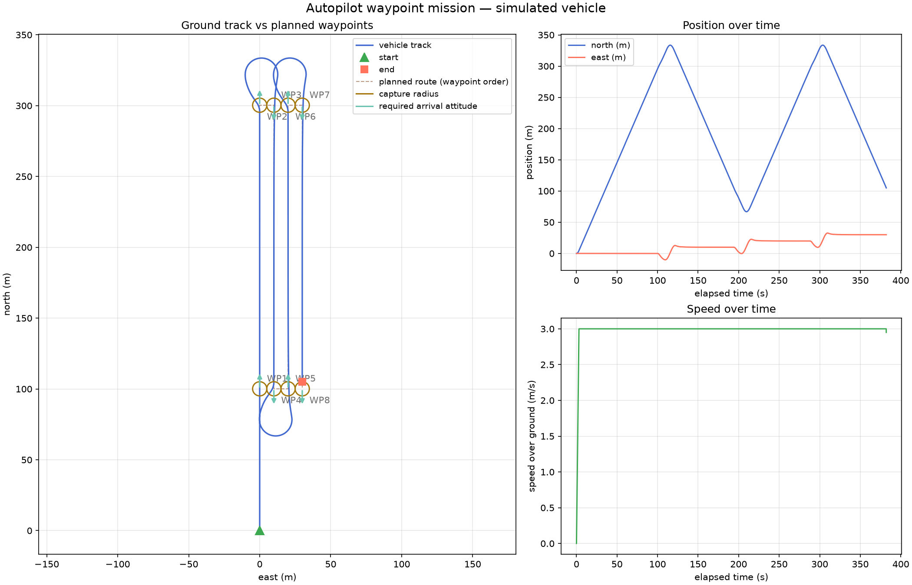
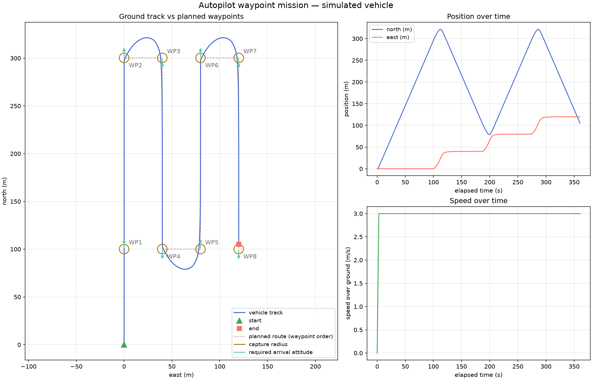

# Autopilot Application

An autopilot built on the umaa-cpp SDK. It consumes UMAA MO **Global Vector** and **Global
Waypoint** driving commands, deconflicts them over a single driving resource, and drives a
swappable vehicle-control strategy off the latest SA navigation data.

## Architecture

Three layers (namespace `arlcore::autopilot`):

1. **`AutopilotApp`** — aggregator/main class. Owns the DDS participant, the three SA nav
   consumers (Global Pose / Speed / Velocity), the two MO command providers, the autopilot
   brain, the vehicle-control strategy, and the platform report providers. Runs one control
   loop (`step()` per tick).
2. **`AutopilotBrain` (`IAutopilot`)** — the shared driving controller. Holds the active mode
   and setpoint, recomputes a `ControlVector` from the latest nav on every pose update, and
   pushes it to the vehicle. Owns the `DrivingResourceArbiter`.
3. **`IVehicleControl` strategy** — hardware abstraction (`SimVehicleControl` provided). Sends
   the control vector and serves the platform specs/capabilities. The sim strategy keeps an
   internal kinematic vehicle (limits from the platform capabilities), integrates it on its
   own thread at `vehicle_control.sim.cycle_rate_hz` acting on the latest setpoint, and
   publishes the three SA navigation reports (Global Pose / Speed / Velocity) — closing the
   control loop exactly as a real vehicle's navigation suite would.

Key components:

- **`DrivingResourceArbiter`** — priority deconfliction. Vector is high priority and preempts
  an active waypoint route (-> `FAILED`/`INTERRUPTED`); a waypoint arriving while a vector
  drives is rejected (-> `FAILED`/`RESOURCE_REJECTED`). Priorities are configurable.
- **`VectorControlServiceProvider` / `WaypointControlServiceProvider`** — UMAA command
  providers (on `CommandProviderBase`). Vector is mostly pass-through with validation against
  the platform speed limit. Waypoint reads its route from the large-list element topic, plans a
  Dubins path, and reports capture progress.
- **`DubinsPathPlanner`** — a true Dubins planner. Every leg (previous waypoint or the
  plan/replan pose, to the next waypoint) is solved as the shortest curvature-bounded Dubins
  path over all six words (LSL/RSR/LSR/RSL/RLR/LRL, closed forms in `DubinsPath`), using the
  platform turn radius (speed / max turn rate). The vehicle follows the planned path with a
  pure-pursuit carrot at `lead_distance_m`, arriving at each waypoint on its commanded
  attitude (waypoints without one get a natural fly-through heading). Elevation and speed are
  passed through per waypoint. Capture is evaluated continuously inside the capture zone;
  exiting the zone without a clean capture — or overflying the planned path without ever
  entering it — counts as a miss and replans the leg from the live pose (a loop-back/spiral),
  bounded by `max_misses_per_waypoint` and `max_replans`. On completion the planner commands
  zero speed.

Navigation drives the control tick: the pose observer fires inside the nav consumer's
`cycle()` and triggers the brain's recompute, so control always uses the latest fix. The
design is single-threaded (one control loop); the mutexes are defensive.

## Configuration

All parameters — including the platform specs/capabilities (which nothing else currently
publishes) — are loaded from YAML (see `config/autopilot.yaml`). On startup the platform
specs and capabilities reports are published once. Capabilities also feed the planner
(turn radius = speed / max turn rate).

## Build

The app builds as part of the SDK when `BUILD_AUTOPILOT_APP=ON` (default). It requires the
SDK's toolchain (CycloneDDS-CXX, GeographicLib, log4cxx, yaml-cpp, and the generated
`umaa-cyclone-cxx-types`), which is provided by the SDK development container.

```bash
mkdir build && cd build
cmake .. -DCMAKE_BUILD_TYPE=Debug -DBUILD_AUTOPILOT_APP=1 -DTEST_COMMON=1
make -j"$(nproc)"
ctest --verbose            # runs autopilot_test among others
./autopilot autopilot.yaml # run the app
```

## Tests

Unit tests live under `test/` (GoogleTest), enabled with `-DTEST_COMMON=1`:

- `DubinsPathTest` — Dubins solver: word selection, degenerate cases, and randomized
  endpoint correctness (2000 configurations).
- `DubinsPathPlannerTest` — route following to completion, arrival-attitude capture,
  loop-around for waypoints behind the vehicle, miss/replan budgets, progress metrics.
- `SimVehicleControlTest` — kinematic limits (turn rate, acceleration, speed caps) and the
  three nav reports, using the SDK's `LocalReaderSender` loopback IO.
- `DrivingResourceArbiterTest` — priority/preempt/reject/release behavior.
- `YamlConfigLoaderTest` — config parsing and defaults.

The full suite (solver randomized endpoint checks, planner follow/replan/miss behavior with a
kinematic sim vehicle, `SimVehicleControl` kinematics + report publishing, arbiter, config)
runs green with `ctest`. An end-to-end waypoint mission over Cyclone DDS is exercised by
`tools/mission_runner` (see `tools/README.md`), which publishes a `GlobalWaypointCommandType`
plus its large-list route, records the vehicle track from the Global Pose reports, and exits
when the command completes.

Recorded end-to-end runs (sim vehicle at 3 m/s over Cyclone DDS on one host, every command
reaching COMPLETED with zero misses/replans) live in `docs/mission-results/`: track/waypoint
CSVs, command status logs, and rendered plots.

The baseline 5-waypoint closed loop (no attitude requirements — capture is position-only):



Survey lawnmower missions with **required arrival attitudes** (north/south lanes) at three
lane spacings — 40 m (wider than the ~28.6 m planned turning circle: simple U-turns), 20 m,
and 10 m (tighter than the planned turn radius: the Dubins solver produces bulb turns that
swing outside the lane ends and re-enter on attitude). Two planner behaviors make these
capture reliably: legs are planned with a turn-radius margin over the vehicle's kinematic
minimum (`planner.turn_radius_margin`) so the controller retains authority to close tracking
error mid-turn, and every leg ends with a straight final-approach runway through the waypoint
so arrival happens with position and attitude already settled rather than on the tail of an
arc.



