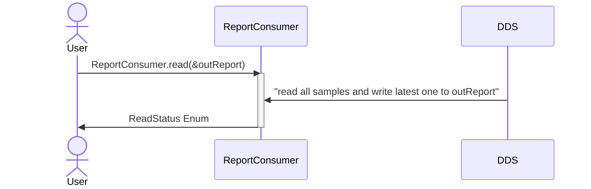
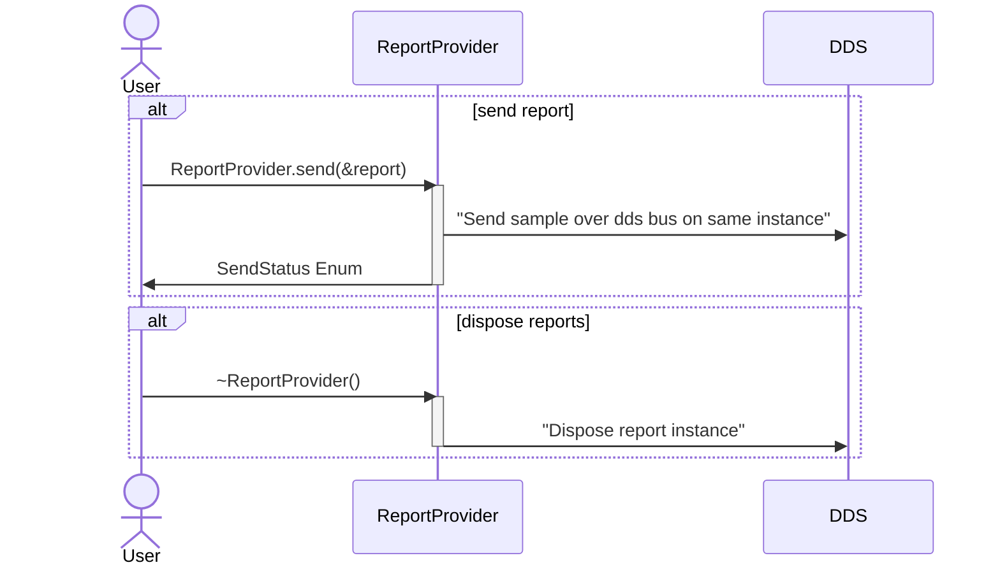
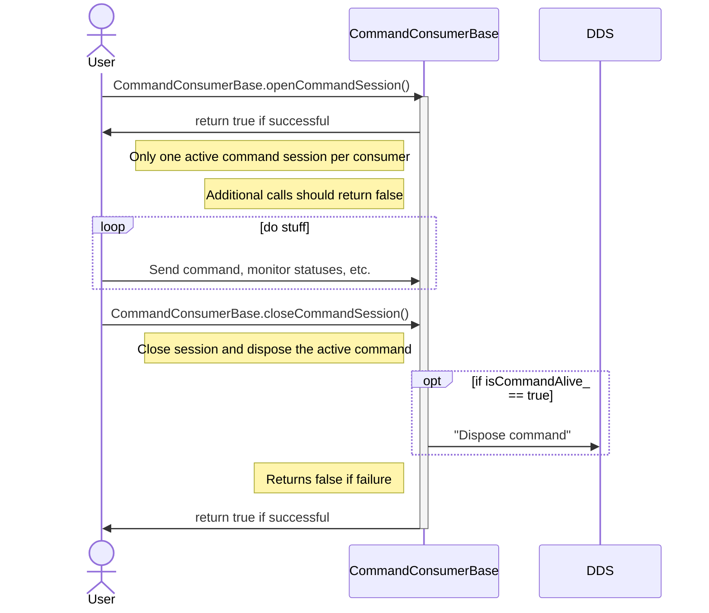
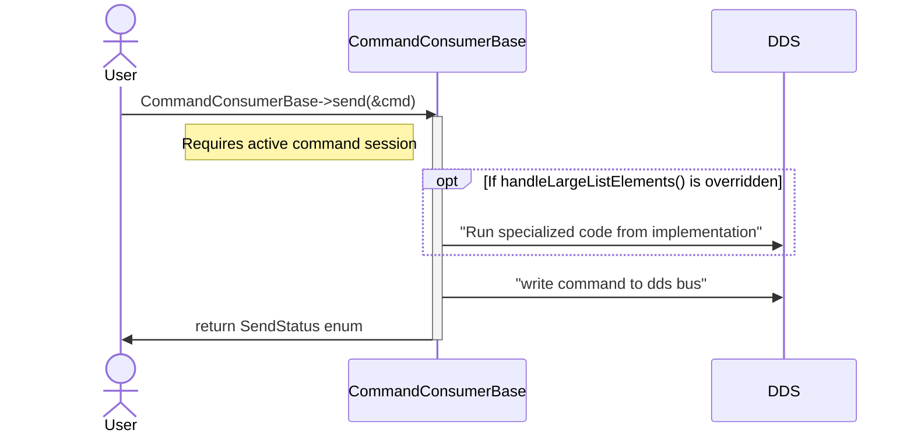
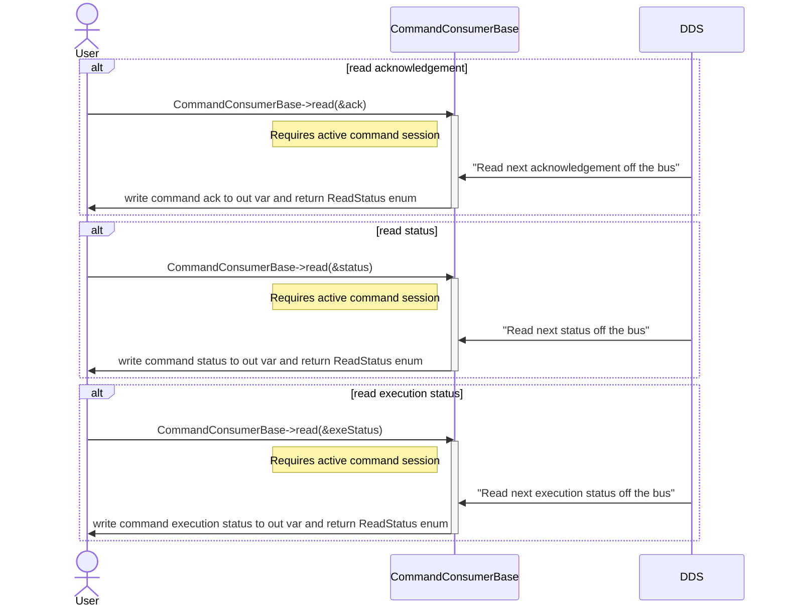
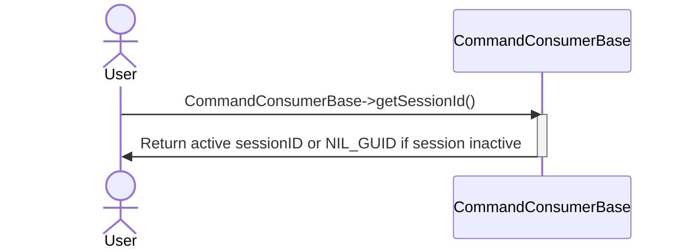

# UMAA Common Service Classes

[[_TOC_]]

## Report Consumer

The ReportConsumer is a simple wrapper around a reader that provides the latest DDS sample off the bus.

If a user should want more frequent updates on data they can increase the rate at which they call this function.

Content filtering is applied at the reader level which is passed into the ReportConsumer constructor.

## Report Provider

The ReportProvider is a simple sender IO object that puts samples on the DDS bus under one instance keyed by the source id of the report provider.

On Shutdown the ReportProvider is responsible for disposing this instance off the bus so no other services use old data.

The ReportProvider exposes the public `send()` function that users can use to send reports.

## Command Consumer Base

A Command Consumer is a UMAA defined IO construct that provides an interface to control a commanded UMAA service, I.e., Waypoint, Global Vector, etc.

A Command Service Consumer creates command sessions that have a unique source ID and session ID.

A command Service Consumer interacts with providers by sending command types and can monitor their progress based on the associated command status and command ack messages.

This class is designed to be inherited and overridden to produce specialized command consumers.

### Opening and Closing Sessions

### Send Commands

### Read Status Functions

### Get Current Session ID

## Command Provider

A UMAA command provider is the partner utility to the command consumer. The provider is responsible for implementing a given command service and responding to commands from one to many service consumers. The command provider base abstracts a majority of the boilerplate code to run a command provider and instead exposes virtual functions that allows implementers to add functionality for every stage of the UMAA command flow in addition to functions that should run to validate a command, check command completion, and check command failure.

### cycling the provider

The provider's main method is cycle(). This function is what implementers will call periodically to read and write command IO, and progress the state of any active commands. Otherwise, with no commands the provider is considered idle.

### Handling reading and writing of command IO

All IO defined in the UmaaCommandProviderIo class is supported by the base provider out-of-box. I.e. there is no need for the implementer to worry about getting the current command and sending statues to the DDS bus. The send and read functions can be overridden if the implementing service has more IO objects than what is supported by the base class. An example of this could be a waypoint service provider. Since in addition to reading the command type (included in the provider base) we also need to read large list element types.

### Implementing service specific functionality

When building a concrete service provider on top of the command provider base class. Developers should only have to override a set of the virtual "on" functions that they need to create service specific functionality.

Here a list of all the available functions that can be overridden to implement specific functionality:

- `onIssued()` This function will get called every time a command transitions into the ISSUED state. The implementer will return true for nominal execution, but also has the ability to return false should something happen that would deem a provider level failure.
- `onCommanded()` This function will get called every time a command transitions into the COMMANDED state. The implementer will return true for nominal execution, but also has the ability to return false should something happen that would deem a provider level failure.
- `onExecuting()` This function will get called every time a command transitions into the EXECUTING state. The implementer will return true for nominal execution, but also has the ability to return false should something happen that would deem a provider level failure.
- `onCompleted()` This function will get called every time a command transitions into the COMPLETED state. The implementer will return true for nominal execution, but also has the ability to return false should something happen that would deem a provider level failure.
- `onCanceled()` This function will get called every time a command transitions into the CANCELED state. The implementer will return true for nominal execution, but also has the ability to return false should something happen that would deem a provider level failure.
- `onFailed()` This function will get called every time a command transitions into the FAILED state. The implementer will return true for nominal execution, but also has the ability to return false should something happen that would deem a provider level failure.
- `onInterrupted()` This function will get called when a new command is received while actively processing another command. The implementer will return true for nominal execution, but also has the ability to return false should something happen that would deem a provider level failure.
- `onUpdated()` This function will get called when a new command is received and determined to be an update to the active command
- `isCommandValid()` This function will get called in between the ISSUED to COMMANDED transition to determine if a command is valid or not. Un-overridden behavior defaults to treating all commands as valid.
- `isCommandCompleted()` This function will get called every cycle while the command is in the EXECUTING state. If this function returns true, the command is allowed to transition to the COMPLETED state, otherwise the command stays in EXECUTING. Un-overridden behavior defaults to never completing a command (return false).
- `isCommandFailed()` This function is also called every cycle while the command is in the EXECUTING state. If this function returns anything other than `CommandStatusReasonEnumType::SUCCESS` then the command is transitioned to the failed state with the provided non-successful status reason. Ex: `CommandStatusReasonEnumType::TIMEOUT`. Un-overridden behavior defaults to always returning `CommandStatusReasonEnumType::SUCCESS`.
- `onCycle()` Last but not least, this function is a catch-all and runs code the implementer would like to run on every call to `cycle()` regardless of what state the current command is in. This includes when there is no active command and the provider is idle. If the implementer would like to access provider data such as the active command, they should do a check on the optional value to see if one is set or not before accessing data. The implementer will return true for nominal execution, but also has the ability to return false should something happen that would deem a provider level failure.

How and when to use these functions is easier explained with an example:

Let's create a made up UMAA Service called HelloWorld. This service shall:

1. read HelloWorldCommands.
2. write "hello world" to the console when the command enters the ISSUED state.
3. Accept any command (No need to validate)
4. Send a UDP message when the command goes to executing
5. Wait to complete the command for 10 seconds after sending the UDP message

These requirements are a little silly, but it is a good exercise in understanding just how adaptable the base provider is. To implement such a service we will need to override a few functions.

- Override onIssued() to write "hello world" to console when a command enters the ISSUED state
- Override onExecuting() to send a UDP message when a command enters the EXECUTING state
- Override isCommandCompleted(), which is called every cycle when the command is executing, to return true 10 seconds after sending the UDP message. Returning true from isCommandCompleted() informs the provider that the command can now transition from the EXECUTING state to the COMPLETED state.

In this imaginary use case, if we override the following functions to do the aforementioned and start to call the cycle() method, we will have a provider that supports the HelloWorld service (with our specific functionality) and under the hood we still get command acknowledgement, statuses, and state machine flow as part of the base class.

_Note: This example could be done many different ways using the functions above. Because of this, the developer has flexibility in how they choose to implement functionality_

### Provider behavior settings

In development, it has been determined that the way a provider handles commands depends on the implementation. To be as flexible as possible, the provider base offers 3 different behavior profiles to best suit the implementation needs:

1. `CANCEL_EXISTING` This mode will cancel any non-terminal active command if a new command is received
2. `COMPLETE_EXISTING` This mode will complete any non-terminal active command if a new command is received
3. `REJECT_INCOMING` This mode will fail any incoming commands that are received while the provider is tracking a different command.

These behavior settings can be viewed/configured dynamically through the public getBehavior() and setBehavior accessors.